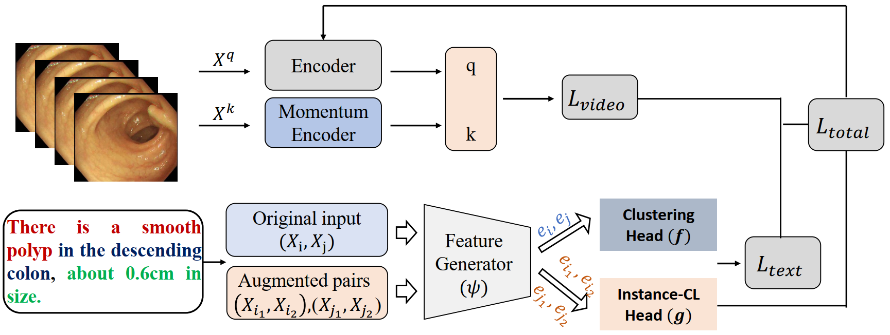

[](https://opensource.org/licenses/MIT)


# Learning Discriminative Visual-Text Representation for Polyp Re-Identification

## Introduction
In this work, we propose a simple but effective training method named \textbf{VT-ReID}, which can remarkably enrich the representation of polyp videos with the interchange of high-level semantic information. Moreover, we elaborately design a novel clustering mechanism to introduce prior knowledge from textual data, which leverages contrastive Learning to promote better separation from abundant unlabeled text data.



### News
- Support Market1501, CUHK03, MSMT17 and Colo-Pair datasets.

## Installation

TorchMultimodal requires Python >= 3.7. The library can be installed with or without CUDA support.
The following assumes conda is installed.

## Instruction
Modify the data path of the code according to your dataset (dataset/lmdb_dataset.py), then perform the following command:

```
CUDA_VISIBLE_DEVICES=0,1,2,3 python -m torch.distributed.launch --nproc_per_node=4 --master_port=30201 main_nce_endo.py --net s3d --model infonce --moco-k 65536 --dataset endo240 --seq_len 32 --ds 1 --batch_size 16 --epochs 700 --schedule 450 700 -j 0
```

## Acknowledgments
This work was supported by the National Natural Science Foundation of China under Projects (Grant No. 81974276 and Grant No.  23X010501967).
If you have further questions and suggestions, please feel free to contact us (xiangsuncheng17@sjtu.edu.cn).

